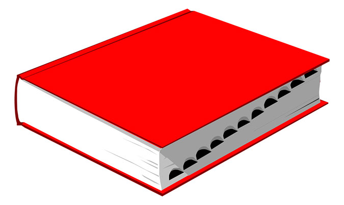

# Dictionary

    

**The Dictionary About (Almost) Everything.**

### About
The idea is to provide definitions for common words and terms in software engineering, cryptography, mathematics and physics - in Layman's terms.  

Especially for beginners, new terms can be overwhelming. This document seeks to solve this by providing real world examples whenever possible. Note that the first two chapters, *Computer Science* and *Encryption*, is covered most heavily (at least at this point). 

**Areas covered by the book at this point:**

    1. Computer science
        1.1 Basic
        1.2 Cybersecurity
        1.3 Networking
        1.4 Software development
        1.5 Hardware
        1.6 Web
        1.7 Operating System
        1.8 Other
    2. Encryption
        2.1 General
        2.2 Symmetric encryption
        2.3 Key exhange
    3. Mathematics
        3.1 Calculus
        3.2 Applied mathematics
    4. Physics
    5. Artificial Intelligence
        5.1 General
        5.2 Search
        5.3 Game theory
        
*The current version (.pdf) can be found [here](./dictionary.pdf).*

### Contribute
The hope is that anyone who wants to learn more about any of the topics in this book, should be able to read a book/article about that topic purely using this dictionary. Therefore, the book should cover *at least* most of the basic and intermediate terms for that topic. To achieve this, any type of contribution, styling, corrections, new definitions, translations is highly encouraged. 
